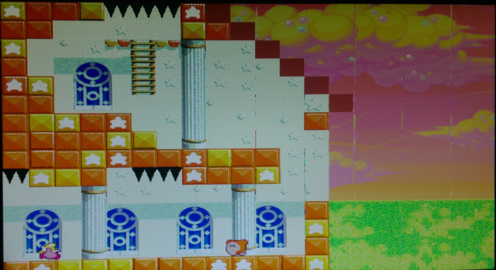
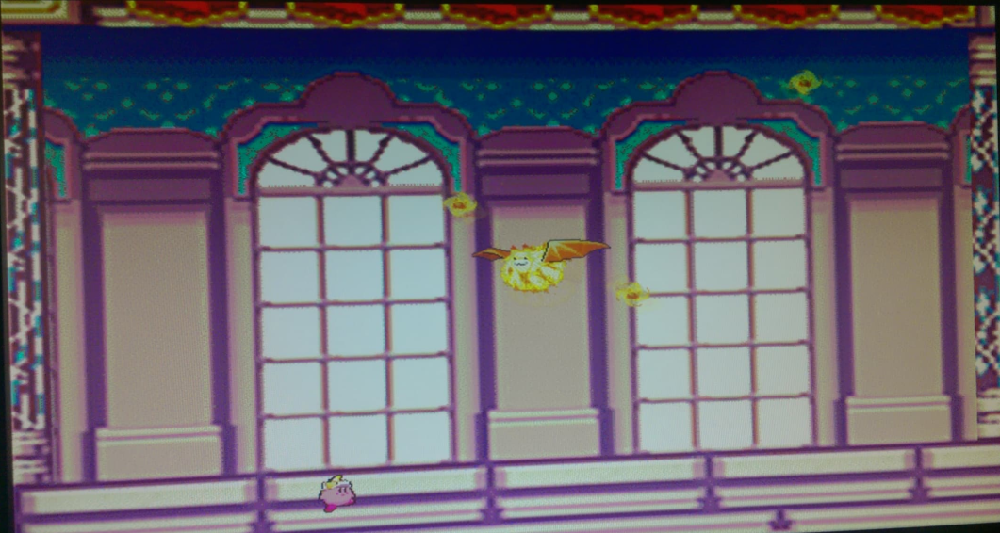

# ECE385_Final_Project

By: Timothy Wong

Demo: https://youtu.be/6eeaDSD7yt0

Do not plagiarize.

Our project for ECE385 is a basic Kirby game. This project was written almost entirely in System Verilog. We used the DE2-115 board. The timeframe for this project was just under a month. The world is lef/right scrollable. There is one basic enemy on the startup. Upon reaching the door on the top, Kirby enters into the boss room. We didn't have time to fully define our health system. Kirby only has one move which is to shoot a star across the screen. 

We used the 2MB SRAM for backgrounds and OCM for sprites. FLASH to hold the sound memory but we were unable to fully get our written driver to fully function correctly. 8 bit color depth was chosen since 16 bit SRAM bit width allows 2 potential image storage per address. Python code (which we adjusted for case) to sample our images were used courtesy to Rishi who wrote it from previous years. We also created some rather simple python code to output some repetitive aspects of our code. The keyboard interfaces with the NIOS system and written in C. This code was mostly provided to use but we tweaked to enable a maximum of 4 simultaneous keypresses. A more in depth reading of our algorithm is noted in our final paper. Shots of the game are shown below. 

  

